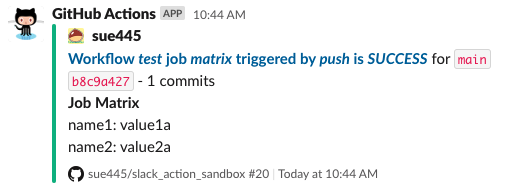
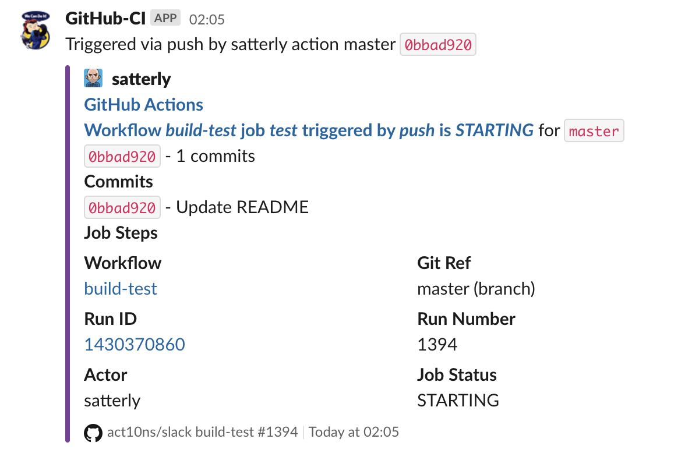

# Slack messages for GitHub Actions workflows, jobs and steps

A simple and flexible Slack integration with GitHub Actions.


## Features

* Advanced users can use a [configuration file](#config-optional) and Handlebars templates to configure every aspect of the Slack message.

* In addition to "legacy" attachments, rich messages can be created using [layout blocks](https://api.slack.com/messaging/composing/layouts) for flexible message visualisation and interactivity.

## Configuration

### Environment Variables (`env`)

#### `SLACK_WEBHOOK_URL` (required)

Create a Slack Webhook URL using either the
[Incoming Webhooks App](https://slack.com/apps/A0F7XDUAZ-incoming-webhooks?next_id=0)
(preferred) or by attaching an incoming webhook to an existing
[Slack App](https://api.slack.com/apps) (beware, channel override not possible
when using a Slack App):

    env:
      SLACK_WEBHOOK_URL: ${{ secrets.SLACK_WEBHOOK_URL }}

### Input Parameters (`with`)

#### `webhook-url` (optional)

Only required if the `SLACK_WEBHOOK_URL` environment variable is not set.

      with:
        webhook-url: ${{ secrets.SLACK_WEBHOOK_URL }}

#### `status` (required)

The `status` must be defined. It can either be the current job status
using:

      with:
        status: ${{ job.status }}

or a hardcoded custom status such as "starting" or "in progress":

      with:
        status: in progress

#### `steps` (optional)

The individual status of job steps can be included in the Slack
message using:

      with:
        status: ${{ job.status }}
        steps: ${{ toJson(steps) }}

**Note: Only steps that have a "step id" will be reported on. See example below.**

#### `matrix` (optional)
Parameters for [matrix jobs](https://docs.github.com/en/actions/using-jobs/using-a-matrix-for-your-jobs) can be included in Slack messages:

      with:
        status: ${{ job.status }}
        matrix: ${{ toJson(matrix) }}



#### `channel` (optional)

To override the channel or to send the Slack message to an individual
use:

      with:
        status: ${{ job.status }}
        channel: '#workflows'

**Note: To override the channel the Slack webhook URL must be an
Incoming Webhook URL. See https://api.slack.com/faq#incoming_webhooks**

### `message` (optional)

To override the slack message use:

      with:
        status: ${{ job.status }}
        channel: '#workflows'
        message: Deploying {{ env.GITHUB_REF_NAME }} branch

### `config` (optional)

A configuration file can be used to customise the following Slack message fields:

  - `username`
  - `icon_url`
  - `pretext`
  - `title` and `title_link`
  - `text`
  - `fallback` plain text summary used for dumb clients and notifications
  - `fields` title, value and short/long
  - `blocks` including `actions`, `context`, `divider`, `file`,  `header`, `image`, `input` and `section` blocks
  - message `footer`
  - border `colors` based job status `success`, `failure`, `cancelled`. valid colors are `good` (green), `warning` (yellow), `danger` (red) or any hex color code eg. `#439FE0`
  - `icons` for step status `success`, `failure`, `cancelled`, `skipped`, and a default

Default: `.github/slack.yml`

      with:
        status: ${{ job.status }}
        config: .github/config/slack.yml

The following Slack [message fields](https://api.slack.com/reference/messaging/attachments) and
[block layouts](https://api.slack.com/reference/block-kit/blocks) support templating using
[Handlebars.js](https://handlebarsjs.com/guide/) format:

- `pretext`
- `title`
- `text` and `message`
- `fallback`
- `fields` `title` and `value`
- `blocks`

**Supported Template variables**

`env.*`, `payload.*`, `jobName`, `jobStatus`, `jobSteps`, `jobMatrix`,
`eventName`, `workflow`, `workflowUrl`, `workflowRunUrl`, `repositoryName`, `repositoryUrl`, `runId`, `runNumber`, `sha`, `shortSha`, `branch`, `actor`, `action`, `ref`, `refType`, `refUrl`, `diffRef`, `diffUrl`, `description`, `sender`

**Helper Functions**

Apart from the [standard helper functions](https://handlebarsjs.com/guide/builtin-helpers.html#if) such as `#if` and `#each` there are also a few custom
ones:

- `icon` converts a job status into an icon eg. `{{icon jobStatus}}`
- `json` dumps the value as a JSON string eg. `{{json payload.commits}}`
- `truncate` cuts the string at the limit eg. `{{truncate sha 8}}`
- `default` allows a alternative or default value eg. `{{default headRef "master"}}`
- `pluralize` outputs different text based on item count eg. `{{pluralize requested_reviewers "reviewer" "reviewers"}}` (if only singular form is given plural is derived by adding an "s")

- `eq`, `neq`, `not`, `and`, and `or` can be used as logical operators eg. `{{#if (and (not has_issues) (or has_pages has_wiki))}}yes{{else}}no{{/if}}`
- `#ifeq` and `#ifneq` test for variable equality or not eg. `{{#ifneq event_name "create"}}yes{{else}}no{{/ifneq}}`

**Example Using Config File**

To generate the message format below use the `slack.yml` configuration file that follows.



*Example Configuration File: slack.yml*

```
username: GitHub-CI
icon_url: https://octodex.github.com/images/mona-the-rivetertocat.png

pretext: Triggered via {{eventName}} by {{actor}} {{or action "action"}} {{ref}} `{{diffRef}}`
title: GitHub Actions
title_link: https://support.github.com

text: |
  *<{{workflowRunUrl}}|Workflow _{{workflow}}_ job _{{jobName}}_ triggered by _{{eventName}}_ is _{{jobStatus}}_>* for <{{refUrl}}|`{{ref}}`>
  {{#if description}}<{{diffUrl}}|`{{diffRef}}`> - {{description}}{{/if}}
  {{#if payload.commits}}
  *Commits*
  {{#each payload.commits}}
  <{{this.url}}|`{{truncate this.id 8}}`> - {{this.message}}
  {{/each}}
  {{/if}}

fallback: |-
  [GitHub] {{workflow}} #{{runNumber}} {{jobName}} is {{jobStatus}}

fields:
  - title: Job Steps
    value: "{{#each jobSteps}}{{icon this.outcome}} {{@key}}\n{{/each}}"
    short: false
  - title: Workflow
    value: "<{{workflowUrl}}|{{workflow}}>"
    short: true
  - title: Git Ref
    value: "{{ref}} ({{refType}})"
    short: true
  - title: Run ID
    value: |-
      <{{workflowRunUrl}}|{{runId}}>
    short: true
  - title: Run Number
    value: "{{runNumber}}"
    short: true
  - title: Actor
    value: "{{actor}}"
    short: true
  - title: Job Status
    value: "{{jobStatus}}"
    short: true

footer: >-
  <{{repositoryUrl}}|{{repositoryName}}> {{workflow}} #{{runNumber}}

colors:
  success: '#5DADE2'
  failure: '#884EA0'
  cancelled: '#A569BD'
  default: '#7D3C98'

icons:
  success: ':white_check_mark:'
  failure: ':grimacing:'
  cancelled: ':x:'
  skipped: ':heavy_minus_sign:'
  default: ':interrobang:'
```

*Notes:*

* If template expressions occur at the start of a string the string must be double-quoted eg. `pretext: "{{eventName}} triggered by {{actor}}"`
* Use [YAML multiline string formats](https://yaml-multiline.info/) `|`, `>`, `|-` and `>-` or double-quotes `"\n"` to control new lines
* Use `~` (tilde) character to control whitepace when looping see [Whitespace control](https://handlebarsjs.com/guide/expressions.html#whitespace-control)

### Conditionals (`if`)

To ensure the Slack message is sent even if the job fails add the
`always()` function:

    if: always()

or use a specific status function to only run when the job status
matches. All possible status check functions are:

* `success()` (default)
* `always()`
* `cancelled()`
* `failure()`

## Examples

To send a Slack message when a workflow job has completed add the
following as the last step of the job:

    - uses: act10ns/slack@v1
      with: 
        status: ${{ job.status }}
      if: always()

To include statuses for each Job Step in the message include the
`steps` input (making sure to use the `toJSON` function):

    - uses: act10ns/slack@v1
      with: 
        status: ${{ job.status }}
        steps: ${{ toJson(steps) }}
      if: always()

Only steps that have a "step id" assigned to them will be reported on:

    - name: Build
      id: build
      run: |
        npm install
        npm run build

The default Slack channel for the configured webhook can be overridden
using either another channel name `#channel` or a username `@username`.

    - uses: act10ns/slack@v1
      with: 
        status: ${{ job.status }}
        channel: '#workflows'

or

    - uses: act10ns/slack@v1
      with: 
        status: ${{ job.status }}
        channel: '@nick'

### Complete example

    name: Docker Build and Push

    on:
      push:
        branches: [ master, release/* ]

    jobs:
      build:
        runs-on: ubuntu-latest
        env:
          REPOSITORY_URL: docker.pkg.github.com
          IMAGE_NAME: ${{ github.repository }}/alerta-cli
          SLACK_WEBHOOK_URL: ${{ secrets.SLACK_WEBHOOK_URL }}
        steps:
          - uses: act10ns/slack@v1
            with:
              status: starting
              channel: '#workflows'
              message: Starting Docker Build and Push...
            if: always()
          - name: Checkout
            uses: actions/checkout@v3
          - name: Variables
            id: vars
            run: echo "::set-output name=SHORT_COMMIT_ID::$(git rev-parse --short HEAD)"
          - name: Build image
            id: docker-build
            run: >-
              docker build
              -t $IMAGE_NAME
              -t $REPOSITORY_URL/$IMAGE_NAME:${{ steps.vars.outputs.SHORT_COMMIT_ID }}
              -t $REPOSITORY_URL/$IMAGE_NAME:latest .
          - name: Docker Login
            env:
              DOCKER_USERNAME: ${{ secrets.DOCKER_USERNAME }}
              DOCKER_PASSWORD: ${{ secrets.GITHUB_TOKEN }}
            run: docker login $REPOSITORY_URL --username "$DOCKER_USERNAME" --password "$DOCKER_PASSWORD"
          - name: Publish Image
            id: docker-push
            run: docker push $REPOSITORY_URL/$IMAGE_NAME

          - uses: act10ns/slack@v1
            with:
              status: ${{ job.status }}
              steps: ${{ toJson(steps) }}
              channel: '#workflows'
            if: always()

The above "Docker Build and Push" workflow will appear in Slack as:


## Troubleshooting

To enable runner diagnostic logging set the `ACTIONS_RUNNER_DEBUG` secret to `true`.

To enable step debug logging set the `ACTIONS_STEP_DEBUG` secret to `true`.

See https://docs.github.com/en/free-pro-team@latest/actions/managing-workflow-runs/enabling-debug-logging

## References

* GitHub Actions Toolkit https://github.com/actions/toolkit/tree/main/packages/github
* GitHub Actions Starter Workflows https://github.com/actions/starter-workflows
* Slack Incoming Webhooks https://slack.com/apps/A0F7XDUAZ-incoming-webhooks?next_id=0
* Env vars https://docs.github.com/en/free-pro-team@latest/actions/reference/environment-variables
* Webhook Payloads https://docs.github.com/en/free-pro-team@latest/developers/webhooks-and-events/webhook-events-and-payloads#webhook-payload-object-common-properties
* GitHub Actions Cheat Sheet https://github.github.io/actions-cheat-sheet/actions-cheat-sheet.html
* Slack Secondary message attachments https://api.slack.com/reference/messaging/attachments
* Handlebars Language Guide https://handlebarsjs.com/guide/
* YAML multiline string formats https://yaml-multiline.info/
* Migrate your legacy message compositions to blocks https://api.slack.com/messaging/attachments-to-blocks

## License

Copyright (c) 2020-2021 Nick Satterly. Available under the MIT License.
