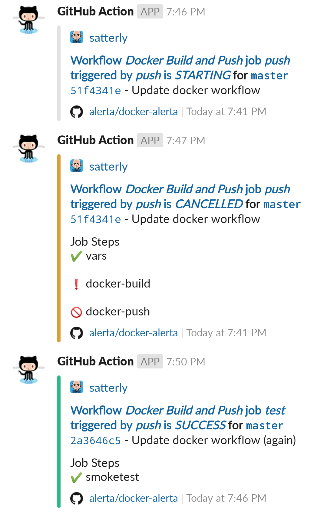
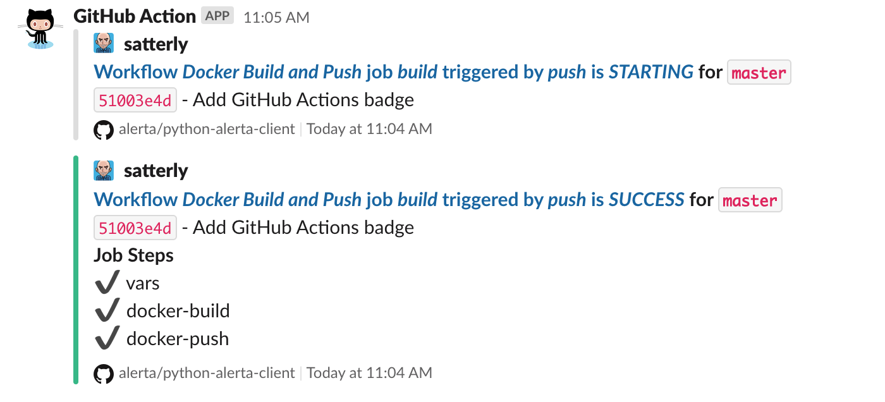

# Slack messages for GitHub Action workflows, jobs and steps

A simple and flexible Slack integration with GitHub Actions.

## Configuration

### Environment Variables (`env`)

#### `SLACK_WEBHOOK_URL` (required)

Create a Slack Webhook URL using either the
[Incoming Webhooks App](https://slack.com/apps/A0F7XDUAZ-incoming-webhooks?next_id=0)
(preferred) or by attaching an incoming webhook to an existing
[Slack App](https://api.slack.com/apps) (beware, channel override not possible
when using a Slack App):

    env:
      SLACK_WEBHOOK_URL: ${{ secrets.SLACK_WEBHOOK_URL }}

### Input Parameters (`with`)

#### `status` (required)

The `status` must be defined. It can either be the current job status
using:

      with: 
        status: ${{ job.status }}

or a hardcoded custom status such as "starting" or "in progress":

      with: 
        status: in progress

#### `steps` (optional)

The individual status of job steps can be included in the Slack
message using:

      with: 
        status: ${{ job.status }}
        steps: ${{ toJson(steps) }}

**Note: Only steps that have a "step id" will be reported on. See example below.**

#### `channel` (optional)

To override the channel or to send the Slack message to an individual
use:

      with: 
        status: ${{ job.status }}
        channel: '#workflows'

**Note: To override the channel the Slack webhook URL must be an
Incoming Webhook URL. See https://api.slack.com/faq#incoming_webhooks**

### Conditionals (`if`)

To ensure the Slack message is sent even if the job fails add the
`always()` function:

    if: always()

or use a specific status function to only run when the job status
matches. All possible status check functions are:

* `success()` (default)
* `always()`
* `cancelled()`
* `failure()`

## Examples

To send a Slack message when a workflow job has completed add the
following as the last step of the job:

    - uses: act10ns/slack@v1
      with: 
        status: ${{ job.status }}
      if: always()

To include statuses for each Job Step in the message include the
`steps` input (making sure to use the `toJSON` function):

    - uses: act10ns/slack@v1
      with: 
        status: ${{ job.status }}
        steps: ${{ toJson(steps) }}
      if: always()

Only steps that have a "step id" assigned to them will be reported on:

    - name: Build
      id: build
      run: |
        npm install
        npm run build

The default Slack channel for the configured webhook can be overridden
using either another channel name `#channel` or a username `@username`.

    - uses: act10ns/slack@v1
      with: 
        status: ${{ job.status }}
        channel: '#workflows'

or

    - uses: act10ns/slack@v1
      with: 
        status: ${{ job.status }}
        channel: '@nick'

### Complete example

    name: Docker Build and Push

    on:
      push:
        branches: [ master, release/* ]

    jobs:
      build:
        runs-on: ubuntu-latest
        env:
          REPOSITORY_URL: docker.pkg.github.com
          IMAGE_NAME: ${{ github.repository }}/alerta-cli
          SLACK_WEBHOOK_URL: ${{ secrets.SLACK_WEBHOOK_URL }}
        steps:
          - uses: act10ns/slack@v1
            with:
              status: starting
              channel: '#workflows'
            if: always()
          - name: Checkout
            uses: actions/checkout@v2
          - name: Variables
            id: vars
            run: echo "::set-output name=SHORT_COMMIT_ID::$(git rev-parse --short HEAD)"
          - name: Build image
            id: docker-build
            run: >-
              docker build
              -t $IMAGE_NAME
              -t $REPOSITORY_URL/$IMAGE_NAME:${{ steps.vars.outputs.SHORT_COMMIT_ID }}
              -t $REPOSITORY_URL/$IMAGE_NAME:latest .
          - name: Docker Login
            env:
              DOCKER_USERNAME: ${{ secrets.DOCKER_USERNAME }}
              DOCKER_PASSWORD: ${{ secrets.GITHUB_TOKEN }}
            run: docker login $REPOSITORY_URL --username "$DOCKER_USERNAME" --password "$DOCKER_PASSWORD"
          - name: Publish Image
            id: docker-push
            run: docker push $REPOSITORY_URL/$IMAGE_NAME

          - uses: act10ns/slack@v1
            with:
              status: ${{ job.status }}
              steps: ${{ toJson(steps) }}
              channel: '#workflows'
            if: always()

The above "Docker Build and Push" workflow will appear in Slack as:

## Troubleshooting

Set the `ACTIONS_STEP_DEBUG` secret to `true`.

## References

* GitHub Actions Toolkit https://github.com/actions/toolkit
* GitHub Actions Starter Workflows https://github.com/actions/starter-workflows
* Slack Incoming Webhooks https://slack.com/apps/A0F7XDUAZ-incoming-webhooks?next_id=0

## License

Copyright (c) 2020 Nick Satterly. Available under the MIT License.
